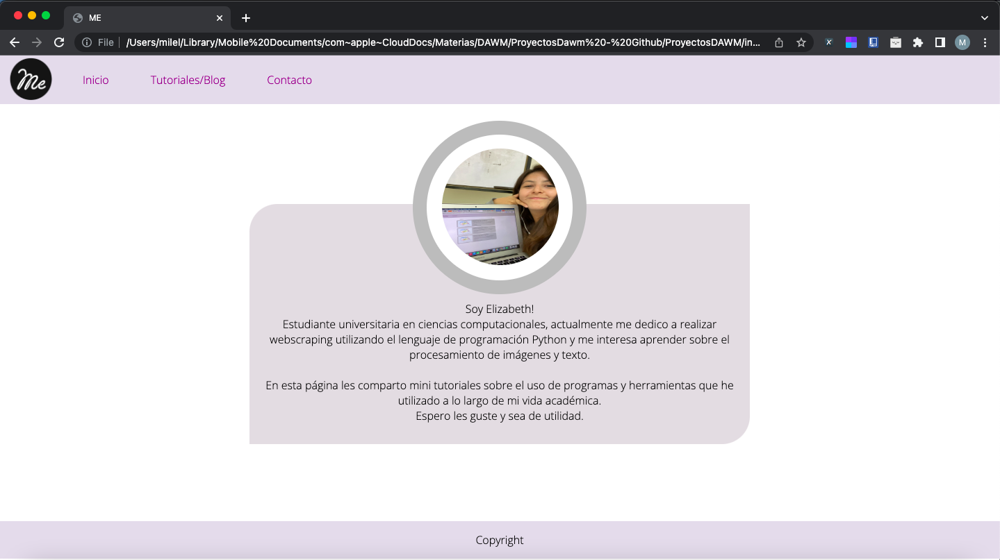
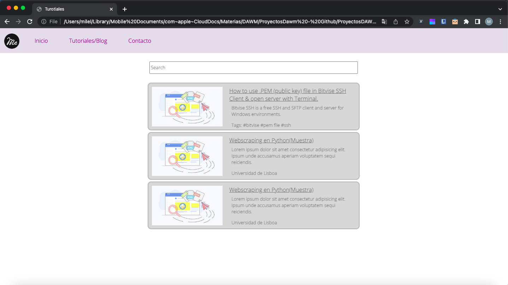
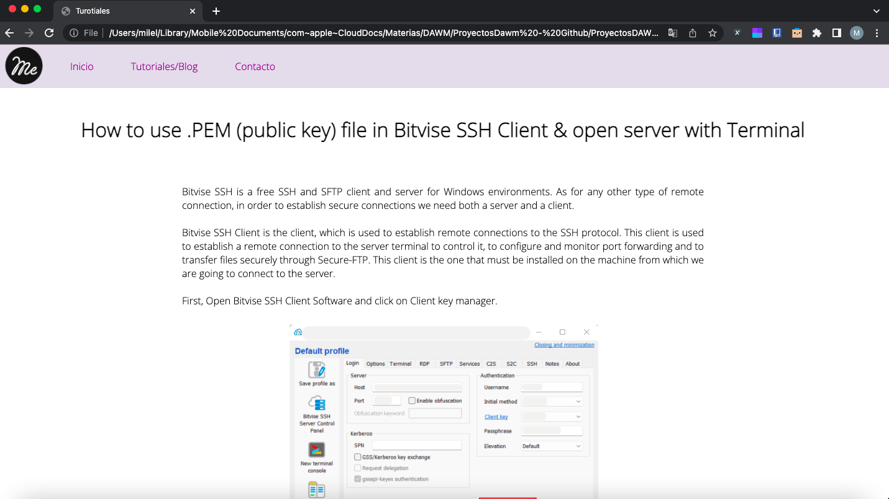
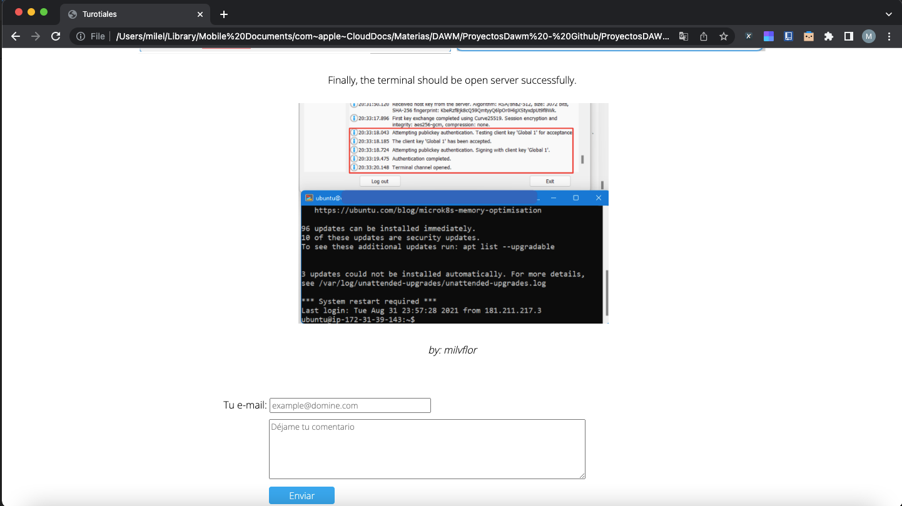
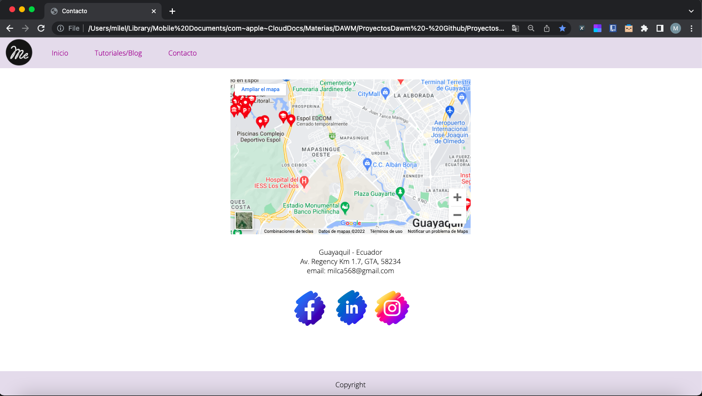

<!-- # ProyectosDAWM -->

## Elaboración de estructura y diseño de una página web, empleando lenguaje de marcado HTML y CSS.

### Capturas de Pantalla

#### Pantalla de inicio

#### Tutoriales/Blog

#### Primer Tuto

#### Contacto

